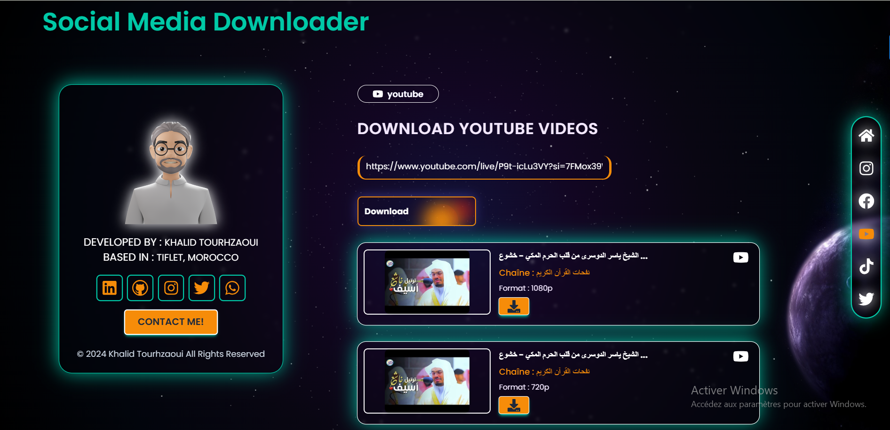

# **Social Media Video Downloader**

Welcome to the **Social Media Video Downloader**! This project allows users to download videos from popular platforms like Instagram, TikTok, YouTube, Facebook, and Twitter.

## **Visit the App:** [Social Media Downloader](https://socialmediadownload.vercel.app/)

---

## **Table of Contents**

- [About the Project](#about-the-project)
- [Features](#features)
- [Technologies Used](#technologies-used)
- [Installation](#installation)
- [Usage](#usage)
- [Contact](#contact)

---

## **About the Project**

This is a modern web application designed for downloading videos from social media platforms. It provides a seamless user experience with responsive design and intuitive animations. The app handles different video URLs, validates them based on the selected platform, and interacts with APIs to fetch video data.

---

## **Features**

- **Multi-Platform Support:**
  - Instagram: Download Stories, Reels, and Videos.
  - TikTok: Download using full or shortened links.
  - YouTube: Fetch and download videos using direct links.
  - Facebook: Supports public video URLs.
  - Twitter: Download videos and GIFs.

- **Error Handling:**
  - Invalid URLs: Displays a friendly error message if the URL doesn’t match the selected platform.
  - API Expiry: Notifies when the API key is expired or invalid.
  - Platform Mismatch: Alerts users if a TikTok URL is entered in the Instagram section, for example.

- **Responsive Design:** Works seamlessly on desktops, tablets, and smartphones.
- **Modern Animations:** Smooth transitions and effects using **Framer Motion**.

---

## **Used Technologies**

- **Frontend:**
  - React.js
  - Tailwind CSS
  - Framer Motion
- **APIs:**
  - RapidAPI (for social media video downloading)
- **Other Tools:**
  - React Icons for platform logos.
  - Axios for API communication.

---

## **Installation**

To set up the project locally, follow these steps:

1. **Clone the repository:**
   ```bash
   git clone https://github.com/your-username/social-media-downloader.git
   ```

2. **Navigate to the project directory:**
   ```bash
   cd social-media-downloader
   ```

3. **Install dependencies:**
   ```bash
   npm install
   ```

4. **Start the development server:**
   ```bash
   npm start
   ```

5. Open your browser and go to `http://localhost:3000` to view the project.


## **Contact**
- **Email:** [khalidtourhzaoui@gmail.com](mailto:khalidtourhzaoui@gmail.com)
- **LinkedIn :** [LinkedIn Profile](https://www.linkedin.com/in/khalid-tourhzaoui/)
- **My website:** [ Contact me](https://khalid-tourhzaoui.vercel.app/contactme)